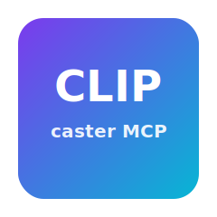

<div align="center">



<h1>
  ✨ Clipcaster MCP ✨
</h1>

<p>
  <strong>CLI‑first, cross‑platform MCP clipboard server</strong><br/>
  <em>面向命令行 AI 工具 · 跨平台 · 零额外依赖（Node ESM）</em>
  <br/>
  <a href="https://www.npmjs.com/package/@martin0359/clipcaster-mcp"></a>
  <a href="https://www.npmjs.com/package/@martin0359/clipcaster-mcp"></a>
  
  <a href="https://github.com/martin0359/clipcaster-mcp/blob/main/LICENSE"></a>
  <a href="https://github.com/martin0359/clipcaster-mcp"></a>
  <br/>
  <a href="#english">English</a> • <a href="#中文">中文</a>
  <br/><br/>
</p>

</div>

---

---

## What's New · 新功能

- Bundle 工具：面向多行命令，既支持整段复制，也支持分条复制。
- 可选本地 HTTP UI：自动在工具返回中附带浏览器地址，点开即可按条复制。
- 重点：完整保留命令格式（引号、空格、heredoc、续行）避免在 CLI/聊天中粘贴被破坏。

---

## English

Clipcaster MCP is a tiny, reliable MCP server that gives AI CLIs clipboard powers via STDIO.

- Tools: `read_clipboard()`, `write_clipboard({ text })`, `clear_clipboard()`, `clipboard_info()`
- OS backends: macOS (pbcopy/pbpaste), Windows (PowerShell), Linux/BSD (wl-clipboard → xclip → xsel)
- X11 fallback: auto `DISPLAY=:0` + `~/.Xauthority` when missing

### Key Benefit
- Paste‑perfect complex commands. Avoids CLI/chat UI reformatting that breaks quotes, spaces, and heredocs.

### Use Cases
- Paste‑perfect complex commands: multi‑line scripts, quotes, spaces, heredocs—no formatting breaks.
- Quick handoff between AI CLI and shell: “Copy this command” instead of manual typing.
- Team workflows: share exact commands/tools without chat platform reformatting.
- Cross‑OS convenience: one MCP tool abstracts different clipboard backends.

— Quick Start —
- Install: `npm i -g @martin0359/clipcaster-mcp`
- Register (Codex): `codex mcp add clipboard -- $(which clipcaster-mcp)`
- Use: in Codex, just say “Copy ‘hello’ to clipboard” (no need to say “use MCP”).

### Use with other AI CLIs
- Any MCP‑capable CLI can register the server command `clipcaster-mcp`.
- Examples (pseudo):
  - Claude Code CLI: `claude-code mcp add clipboard -- $(which clipcaster-mcp)`
  - Gemini CLI: `gemini mcp add clipboard -- $(which clipcaster-mcp)`

 

### Troubleshooting
- No tools listed: restart the CLI, ensure `codex mcp list` shows `clipboard`.
- Timeout: run `npm install` in project folder; register using absolute path; on Linux install `wl-clipboard` or `xclip`.
- Linux write fails: check `DISPLAY`/Wayland; optionally set `env = { DISPLAY=":0", XAUTHORITY="~/.Xauthority" }` in the client MCP config.

---

---

## 中文

Clipcaster MCP 是一个面向“命令行 AI 工具”的轻量 MCP 服务器，通过 STDIO 让 AI 具备读写系统剪贴板的能力。

- 工具: `read_clipboard()`, `write_clipboard({ text })`, `clear_clipboard()`, `clipboard_info()`
- 系统后端: macOS(pbpaste/pbcopy)、Windows(PowerShell)、Linux/BSD(wl-clipboard → xclip → xsel)
- X11 自适应: 若未传入图形环境，自动尝试 `DISPLAY=:0` 与 `~/.Xauthority`

### 关键价值
- 复杂命令“完美粘贴”，防止在 CLI/聊天界面中被自动换行或格式化破坏（引号、空格、heredoc 等）。

### 应用场景
- 复杂命令“完美粘贴”：多行脚本、引号、空格、heredoc 不再被聊天/终端折叠或破坏。
- AI CLI ↔ 终端快捷分工：直接说“把命令复制到剪贴板”，少打字、少出错。
- 团队共享：把完全一致的命令分发给同事，避免格式化差异。
- 跨系统统一：一个 MCP 工具屏蔽不同系统的剪贴板差异。

— 快速开始 —
- 安装: `npm i -g @martin0359/clipcaster-mcp`
- 在 Codex 中注册: `codex mcp add clipboard -- $(which clipcaster-mcp)`
- 使用: 直接说“把‘hello’复制到剪贴板”，无需强调“使用 MCP”。

### 适配其他 AI CLI
- 任何支持 MCP 的 CLI 都可以把 `clipcaster-mcp` 注册为服务器命令。
- 示例（思路）：
  - Claude Code CLI: `claude-code mcp add clipboard -- $(which clipcaster-mcp)`
  - Gemini CLI: `gemini mcp add clipboard -- $(which clipcaster-mcp)`

### 常见问题
- 看不到工具: 重启 CLI；确认 `codex mcp list` 里有 `clipboard`。
- 超时: 在项目目录执行 `npm install`；注册时使用绝对路径；Linux 安装 `wl-clipboard` 或 `xclip`。
- Linux 写入失败: 检查 `DISPLAY`/Wayland；必要时在该 CLI 的 MCP 配置中为本服务器添加 `env = { DISPLAY=":0", XAUTHORITY="~/.Xauthority" }`。

---

---

## Install & Register

```bash
# Global install (one of)
npm i -g @martin0359/clipcaster-mcp

# Register with Codex (idempotent)
codex mcp remove clipboard || true
codex mcp add clipboard -- $(which clipcaster-mcp)
codex mcp list
```

---

## Bundle Tools (multi‑line commands)

- `write_bundle({ text, split_mode? })` → Save a bundle (split into items) and copy full text to clipboard. `split_mode`: `smart` (default) | `simple` | `strict`.
- `list_bundle_items({ bundleId?, offset?, limit? })` → List items: `{ index, preview, bytes }`.
- `copy_bundle_item({ index, bundleId? })` → Copy one item to clipboard (format preserved).
- `get_bundle_item({ index, bundleId? })` → Return full text of an item.
- `bundle_info()` → `{ bundleId, count, ui }`.
- `clear_bundle()` → Clear current bundle.

Notes
- Smart split keeps fenced code blocks, heredocs, and trailing backslash continuations intact.
- Strict split only breaks on blank‑line separators.

---

## Optional Local HTTP UI

Enable a lightweight local UI (loopback only) to browse and copy bundle items with one click. Disabled by default.

```bash
# Enable HTTP UI for current session
export CLIPCASTER_HTTP=1
# Optional: override host/port/token
# export CLIPCASTER_HTTP_HOST=127.0.0.1
# export CLIPCASTER_HTTP_PORT=0   # 0 = pick a free port
# export CLIPCASTER_HTTP_TOKEN=your_token

# Then start your AI CLI (e.g. Codex); the MCP server will spawn the UI.
# Discover URL via tool:
# codex → call tool: bundle_info()  → ui.url
```

Behavior
- Runs on `127.0.0.1` with a random token; token required for all actions.
- Purely optional; STDIO tools continue to work identically on all platforms.
- No desktop/GUI dependency; just open in your browser.

Security
- UI listens only on loopback and requires token.
- Data is stored locally under `~/.config/clipcaster/bundles.json` (recent bundle metadata + last bundle items).

---

## Dev

```bash
cd mcp && npm install
node ./clipboard-server.js  # waits for MCP client over STDIO
```

---

## License

---

## Supported AI CLIs · 已支持/适配的 CLI

- Codex CLI（OpenAI Codex）
- MCP Inspector（调试/测试 MCP 服务器）
- Claude Code CLI（若提供 MCP 注册能力）
- Gemini CLI（若提供 MCP 注册能力）
- 任何支持 MCP·STDIO 的 AI CLI 客户端（可通过命令 `clipcaster-mcp` 注册）

 

Tips
- 若某 CLI 仅支持 HTTP 传输，可扩展一个可选 HTTP 入口（保持 STDIO 作为默认）。如需我添加，请告知。

MIT © 2025 martin0359
